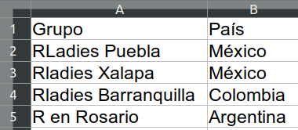

class: right, middle
```{r setup, include=FALSE}
xaringanExtra::use_xaringan_extra("tachyons")
xaringanExtra::use_extra_styles(
  hover_code_line = TRUE,         
  mute_unhighlighted_code = TRUE  
)
library(fontawesome)
library(tidyxl)
library(kableExtra)
library(unheadr)
```


# Dónde encontrarme...

[`r fa(name = "twitter")` @LuisDVerde](https://twitter.com/LuisDVerde)  
[`r fa(name = "github")` @LuisDVA](https://github.com/luisdva)  
[`r fa(name = "link")` liomys.mx](https://liomys.mx)  
[`r fa(name = "paper-plane")` luis@liomys.mx](mailto:luis@liomys.mx)


---
# Hojas de cálculo

## >800,000,000 usuarios de Excel [(2018)](http://grid.is)
## ~170,000,000 usuarios de Google Sheets [(2018)](http://grid.is)

.pull-left[
.f4[[VisiCalc, 1983](https://en.wikipedia.org/wiki/VisiCalc)
]
]

.pull-right[
.f4[[Registro de préstamos. Roma, 1593](https://librarysearch.temple.edu/catalog/991029783589703811
)]  
]
---
# Hojas de cálculo en disco

##xls

.f3[Excel 2003 - Archivo binario, patentado por MS. Permite macros.]

#xlsx
.f3[Excel 2007 en adelante - Formato XML. Con compresión. No permite macros. Almacena más filas y columnas que `.xls`.]

##ods
.f3[OpenOffice, StarOffice & LibreOffice - Formato XML similar a xlsx. Licencia CC.
]

---
background-image: url("imgs/recosistema.png")

---
class: center, middle
# Organización de datos

---
class: center, middle

por  [Christian Wijaya](https://asapguide.com/how-to-make-8-bit-art-using-microsoft-excel/)

---
class: center, middle


Broman & Woo ([2018](https://doi.org/10.1080/00031305.2017.1375989))

---
# Organización de datos
.right-column[
.center[
.f2[Nombres adecuados

Un solo valor por celda

Fechas en AAAA-MM-DD

Sin celdas vacías  (**Rectangular**)

Sin colores ni estilos de letra

Guardar como archivo de texto]]]

.left-column[

]
---
class: center, middle


---
class: center, middle
# Importando datos
##GUI de RStudio (`readxl`)  
##`readxl`  
[https://readxl.tidyverse.org/](https://readxl.tidyverse.org/)

---
background-image: url(https://raw.githubusercontent.com/tidyverse/readxl/master/man/figures/logo.png)
background-position: 90% 5%
background-size: 10% 
# Importar con `readxl`
.left-column[
```{r, eval=FALSE}
library(readxl)
read_xls()
read_xlsx()
read_excel()
```
]
.right-column[

Archivos Excel 2003 (mediante la librería de C `libxls`)   
Archivos Excel 2007 (mediante la librería de C++ `RapidXML`)  
adivina el formato
]<br>

<br>
<br>
<br>
<br>
<br>
### Argumentos importantes
```{r, eval=FALSE}
read_excel(path = ,  # ruta del archivo
           sheet = , # nombre, o número que indica la posición
           range = , # celdas a importar (opcional)
           )
```

---
background-image: url("https://www.clondalkingroup.com/wp-content/uploads/2015/03/Bundle-wrap.jpg")
background-size: cover

---
# Ejemplo cafetería
```{r, eval=FALSE}
read_excel("hojas_calc/cafeteria.xlsx",sheet = 4)
```
  

---
# Usando rangos
.center[.middle[
]]

---
# Hojas / Pestañas 
.center[]  


Mostrar los nombres de las pestañas
```{r, eval=FALSE}
ruta %>%
  excel_sheets() 
```

Importar pestañas por nombre o por ubicación
```{r, eval=FALSE}
ruta %>%
  read_excel(sheet = "nombre de la hoja")

ruta %>%
  read_excel(sheet = 1)

```

---
background-image: url(https://raw.githubusercontent.com/tidyverse/purrr/master/man/figures/logo.png)
background-position: 90% 5%
background-size: 10% 
# > 1 hoja/pestaña

.center[
Lise Vaudoir ([2018](https://perso.ens-lyon.fr/lise.vaudor/iterer-des-fonctions-avec-purrr/))]

---
background-image: url(https://raw.githubusercontent.com/tidyverse/purrr/master/man/figures/logo.png)
background-position: 90% 5%
background-size: 10% 
# > 1 hoja/pestaña

##.center[¿Qué hacemos con cada tabla?]
 
---
class: middle, center, inverse
#¿Dudas?
---
class: middle, center


---
class: middle, center


---
class: middle, center


---
#`tidyxl` <small>- Duncan Garmonsway ([@nacnudus](https://twitter.com/nacnudus))</small>
.center[]

---
class: center, middle


---
#¿Qué hay detrás de las celdas?

```{r include=FALSE}
rlad <- tibble::tribble(
                  ~Grupo,       ~País,
        "RLadies Puebla",    "México",
        "Rladies Xalapa",    "México",
  "Rladies Barranquilla",  "Colombia",
          "R en Rosario", "Argentina"
  )

```

```{r echo=FALSE}
knitr::kable(rlad,format = "html")
```


.pull-left[

En la hoja de cálculo
  
]
.pull-right[

.right[Dentro del archivo xlsx]
  
]

---
```{eval=FALSE}
<sst count="10" uniqueCount="9">
<si>
<t xml:space="preserve">Grupo</t>
</si>
<si>
<t xml:space="preserve">País</t>
</si>
<si>
<t xml:space="preserve">RLadies Puebla</t>
</si>
<si>
<t xml:space="preserve">México</t>
</si>
<si>
<t xml:space="preserve">Rladies Xalapa</t>
</si>
<si>
<t xml:space="preserve">Rladies Barranquilla</t>
</si>
<si>
<t xml:space="preserve">Colombia</t>
</si>
<si>
<t xml:space="preserve">R en Rosario</t>
</si>
<si>
<t xml:space="preserve">Argentina</t>
</si>
</sst>
```

---
class: center, middle
.pull-left[
###Sin formato
]
.pull-right[
### Con formato (y comentarios)
]
---
```{r include=FALSE}
ruta_rladies <- "/media/luisd/H/sync/Dropbox/darcyDB/PDRF/latinr_2020/hojas_calc/rladies.xlsx"
celdas_rladies  <- tidyxl::xlsx_cells(ruta_rladies)
```
 
```{r, eval=FALSE}
tidyxl::xlsx_cells("hojas_calc/rladies.xlsx")
```

```{r, echo= FALSE}
kable(celdas_rladies, "html") %>% kable_styling("striped",font_size = 7 ) %>% scroll_box(width = "100%")
```
---
```{r include=FALSE}
ruta_rladies_formato <- "/media/luisd/H/sync/Dropbox/darcyDB/PDRF/latinr_2020/hojas_calc/rladies-formato.xlsx"
celdas_rladies_formato  <- tidyxl::xlsx_cells(ruta_rladies_formato)
```
 
```{r, eval=FALSE}
tidyxl::xlsx_cells("hojas_calc/rladies-formato.xlsx")
```

```{r, echo= FALSE}
kable(celdas_rladies_formato, "html") %>% kable_styling("striped",font_size = 7 ) %>% scroll_box(width = "100%")
```
---
```{r include=FALSE}
ruta_rladies_formato <- "/media/luisd/H/sync/Dropbox/darcyDB/PDRF/latinr_2020/hojas_calc/rladies-formato.xlsx"
rladies_formato  <- tidyxl::xlsx_formats(ruta_rladies_formato)
```
 
```{r, eval=FALSE}
tidyxl::xlsx_formats("hojas_calc/rladies-formato.xlsx")$local$font
```

```{r, echo= FALSE}
kable(rladies_formato$local$font, "html") %>% kable_styling("striped",font_size = 7 ) %>% scroll_box(width = "100%")
```

```{r, eval=FALSE}
tidyxl::xlsx_formats("hojas_calc/rladies-formato.xlsx")$local$font$bold
```

```{r, echo= FALSE}
kable(rladies_formato$local$font$bold, "html") %>% kable_styling("striped",font_size = 7 ) %>% scroll_box(width = "100%")
```
---
background-image: url(https://unheadr.liomys.mx/reference/figures/logosmall.png)
background-position: 90% 5%
background-size: 20% 
#`unheadr`

Verbos estilo `dplyr` para trabajar con datos desordenados.  
  
  
  
    
.f5[_unheadr 0.2.2 incluye la function `annotate_mf_all()`_ que trabaja en todas las variables en un solo paso.]

.left-column[


]

.right-column[
Función `annotate_mf()`  
  
Convierte el formato en anotaciones dentro de una nueva variable.
```{r, eval=FALSE}
ruta_formato <- "hojas_calc/rladies-formato.xlsx"
annotate_mf(
  xlfilepath = ruta_formato, # ruta del xlsx
  orig = Grupo, # variable con formato
  new=Grupo_fmt) # nueva variable a insertar
```
]  
---
```{r xaringan-editable, echo=FALSE}
xaringanExtra::use_editable(expires = 1)
```

```{r, eval=FALSE}
ruta_formato <- "hojas_calc/rladies-formato.xlsx"
annotate_mf(xlfilepath = ruta_formato,  orig = Grupo, new= Grupo_fmt)
```

```{r echo=FALSE}
ruta_formato <- "/media/luisd/H/sync/Dropbox/darcyDB/PDRF/latinr_2020/hojas_calc/rladies-formato.xlsx"
annotate_mf(ruta_formato,orig = Grupo, new=Grupo_fmt)
```

.f2.blue[Formatos disponibles:]
- Letra en negritas
- Letra en cursiva
- Texto subrayado
- Celdas de colores (se muestra el código html de los colores)

.f2.blue[Aceptando sugerencias...]
.can-edit[
-  
-  
-  

]
---
background-image: url(https://docs.ropensci.org/writexl/hexlogo.png)
background-position: 90% 5%
background-size: 10% 
# Exportando archivos 

##.center[[`writexl`](https://docs.ropensci.org/writexl/) por [Jeroen Ooms](https://twitter.com/opencpu)]

.f2[Una sola hoja]
```{r, eval=FALSE}
write_xlsx(mi_tabla,path = "ruta.xlsx")
# con nombre de hoja
write_xlsx(list(nombre_de_hoja=mi_tabla),path = "ruta.xlsx")
```

.f2[Múltiples hojas]
```{r, eval=FALSE}
# lista con nombres de las hojas
write_xlsx(list(hoja1=mi_tabla,hoja1_copia=mi_tabla),path = "ruta.xlsx")
```

.bottom[.right[`writexl` no requiere Java ni Excel]]

---
background-image: url(https://docs.ropensci.org/writexl/hexlogo.png)
background-position: 90% 5%
background-size: 10% 
# Exportando archivos 

##.center[[`writexl`](https://docs.ropensci.org/writexl/) por [Jeroen Ooms](https://twitter.com/opencpu)]

.f2[Operaciones con grupos, un archivo por grupo]
```{r, eval=FALSE}
vehic3 %>% 
   group_by(traccion) %>% 
   group_walk(~
    write_xlsx(.x,
    path = file.path(
      paste0(.x$traccion,".xlsx"))), # construir rutas
    .keep=TRUE) # retiene la variable de los grupos
   
```
---
background-image: url(https://raw.githubusercontent.com/tidyverse/dplyr/master/man/figures/logo.png)
background-position: 90% 5%
background-size: 10% 
# > 1 hoja/pestaña


Lise Vaudoir ([2018](https://perso.ens-lyon.fr/lise.vaudor/iterer-des-fonctions-avec-purrr/))
---
background-image: url(https://raw.githubusercontent.com/tidyverse/googlesheets4/master/man/figures/logo.png)
background-position: 90% 5%
background-size: 10% 
# googlesheets4
.f3[Requiere cuenta de Google para escribir en hojas de cálculo en línea o para leer documentos privados.]

.f3[Requiere autorización y consentimiento para conectar R con el API de Google, conforme a la [**Política de Privacidad de Datos de Tidyverse.**](https://www.tidyverse.org/google_privacy_policy/)]

.f2[No requiere cuenta ni autorización para leer hojas de Google Sheets compartidas públicamente]

```{r, eval=FALSE}
gs4_deauth() # Para indicar que no hace falta ficha de acceso ni cuenta 
read_sheet() # Para leer un documento con url o ID de documento
write_sheet() # Para escribir en un documento
```

---
background-image: url(https://raw.githubusercontent.com/chainsawriot/readODS/master/man/figures/read_ods_logo.png)
background-position: 90% 5%
background-size: 10% 

#¿.ods?
--

#[`readODS`](https://github.com/chainsawriot/readODS/)

Mismos argumentos que `readxl`
.left-column[
```{r, eval= FALSE}

read_ods()
write_ods()
```
]
.right-column[
Importar .ods, especificando hoja y rango  
Especificando ruta
]
---
class: middle, center, inverse
#¿Dudas?

---
# Recursos

https://rstudio-conf-2020.github.io/r-for-excel/  

https://www.businessinsider.com/satya-nadella-excel-is-microsofts-best-consumer-product-2016-6?r=UK

https://nacnudus.github.io/spreadsheet-munging-strategies/index.html  

https://speakerdeck.com/jennybc/spreadsheets

https://github.com/jennybc/2016-06_spreadsheets

https://beyondspreadsheetswithr.com/  

https://www.wsj.com/articles/do-you-really-need-microsoft-office-anymore-1407873198

http://rpubs.com/dgrtwo/tidying-enron

https://github.com/ianmoran11/locatr  

https://github.com/r-rudra/tidycells

https://luisdva.github.io/pls-don't-do-this/
https://luisdva.github.io/rstats/spreadsheets-mf/
